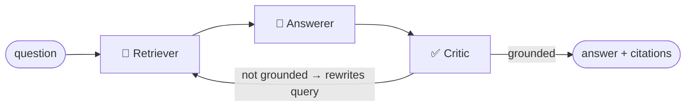

# grounded-rag

> Multi-agent RAG that **refuses to hallucinate**: a LangGraph pipeline where a Critic agent verifies every answer against the retrieved sources — and retries the search when the evidence is missing. 100% local (Ollama + Chroma), no API keys.

[](https://github.com/fluiz7/grounded-rag/actions/workflows/ci.yml)


Plain RAG chains answer even when the retrieved context doesn't support the answer — that's where hallucinated citations come from. **grounded-rag** adds an agentic verification loop on top of retrieval:



- **Retriever** — semantic search over your PDFs (Chroma, embedded).
- **Answerer** — answers *only* from the retrieved context, with inline `[n]` citations.
- **Critic** — a second LLM pass that audits the answer: if any claim is unsupported, it **rewrites the search query** and sends the pipeline back to retrieval (bounded by a retry budget).

The whole loop is a compiled [LangGraph](https://github.com/langchain-ai/langgraph) state machine — see [`src/graph.py`](src/graph.py).

## Quickstart

**Prereqs:** Python 3.11+, [Ollama](https://ollama.com) installed and running.

```bash
# 1. models (one-time, ~5 GB total)
ollama pull llama3.1
ollama pull nomic-embed-text

# 2. install (in a virtualenv)
python -m venv .venv
.venv\Scripts\activate          # Windows PowerShell  (Linux/macOS: source .venv/bin/activate)
pip install -r requirements.txt

# 3. index your PDFs (a file or a whole folder)
python -m src.cli ingest ./papers

# 4. ask — answers come with citations
python -m src.cli ask "What factors drive latency in edge computing under mobility?"
```

> ⚠️ Every `python` above must be the **virtualenv's** Python. If you skipped `activate`, prefix commands with `.venv\Scripts\python.exe` (Windows) / `.venv/bin/python` — a bare global `python` will fail with `ModuleNotFoundError: langgraph`.

Example output:

```
=== ANSWER ==================================================
Latency is primarily driven by signal quality rather than raw distance [1][3].
Weak signal conditions trigger retransmissions, producing heavy latency
tails of several seconds [1]. Linear fits of latency vs. distance show very
low R², confirming distance alone is a weak predictor [2].

=== SOURCES =================================================
  [1] wgrs2024.pdf — page 9
  [2] vehiclouds2024.pdf — page 6
  [3] wgrs2024.pdf — page 12
```

Add `--verbose` to see the critic's verdict and how many retrieval rounds were used.

## How the Critic loop works

1. The Answerer must cite every claim with `[n]` markers, or explicitly say the context doesn't contain the answer.
2. The Critic re-reads *question + context + answer* and emits a strict verdict (`GROUNDED: yes/no`). When the verdict is **no**, it also proposes a sharper search query.
3. The graph routes back to the Retriever with the rewritten query — up to `RAG_MAX_RETRIES` times (default 2) — then stops and reports the best grounded attempt.

This pattern (generate → verify → refine retrieval) is a minimal, readable implementation of the *corrective RAG* idea, in ~100 lines of graph code.

## Configuration

Everything is tunable via environment variables (see [`src/config.py`](src/config.py)):

| Variable | Default | Meaning |
|---|---|---|
| `RAG_CHAT_MODEL` | `llama3.1` | Ollama chat model |
| `RAG_EMBED_MODEL` | `nomic-embed-text` | Ollama embedding model |
| `OLLAMA_BASE_URL` | `http://localhost:11434` | Ollama endpoint |
| `RAG_TOP_K` | `5` | chunks retrieved per round |
| `RAG_MAX_RETRIES` | `2` | extra retrieve→answer→critic cycles |
| `RAG_CHUNK_SIZE` / `RAG_CHUNK_OVERLAP` | `1000` / `150` | splitter settings |

## Project layout

```
src/
├── config.py   # env-driven settings
├── llm.py      # Ollama + Chroma factories (single place to swap backends)
├── ingest.py   # PDF -> chunks -> embeddings -> Chroma
├── graph.py    # the LangGraph state machine (Retriever / Answerer / Critic)
└── cli.py      # ingest & ask commands
```

## Testing

The agent pipeline is fully unit-tested **without any LLM server**: a scripted fake chat model and an in-memory vector store drive the LangGraph state machine through its happy path, the critic-rejects-and-rewrites retry loop, and the retry-budget cutoff.

```bash
pip install -r requirements-dev.txt
ruff check src tests   # lint
pytest                 # 9 tests, < 2s, no Ollama needed
```

CI runs the same lint + tests on Python 3.11 and 3.12 for every push (see badge above).

## Why local?

Running on Ollama means anyone can clone and reproduce the demo without API keys or cost — and the architecture is backend-agnostic: swapping `llm.py` to a hosted model (Claude, GPT, Bedrock) is a one-file change.

## License

[MIT](LICENSE) — © Luiz Felipe Cantanhede Cristino.
